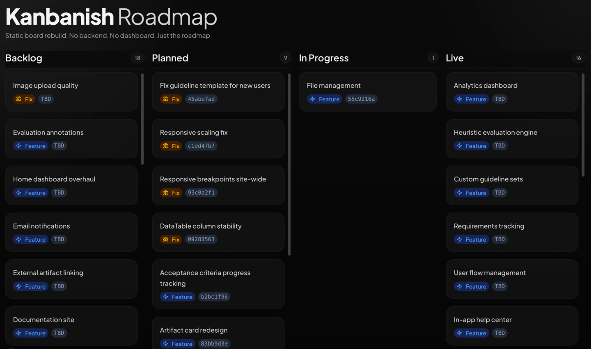

# Kanbanish

A tiny standalone Kanban-style roadmap board.

This started as part of a larger internal project, then got rebuilt as a small static project. No auth, no backend, no database, no app shell. Just a clean board with status columns and a detail modal.

## Screenshot



## Stack

- Next.js
- React
- Tailwind CSS
- TypeScript
- Bun

## Run Locally

[Bun](https://bun.sh) required. Clone the repo, `cd` into the folder, then:

```bash
bun install
bun run dev
```

Open [http://localhost:3000](http://localhost:3000). No `.env` or database.

## Build

```bash
bun run build
bun run start
```

## Notes

- The roadmap data is currently hardcoded in `app/page.tsx`.
- The project is meant to stay simple and easy to fork.